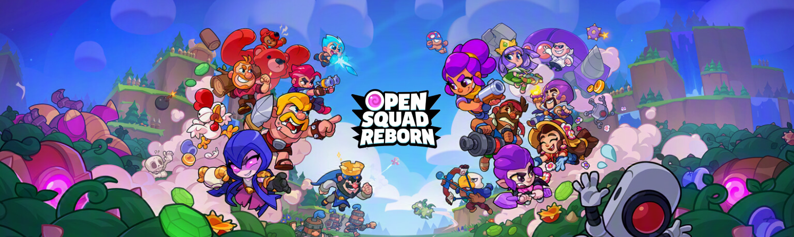
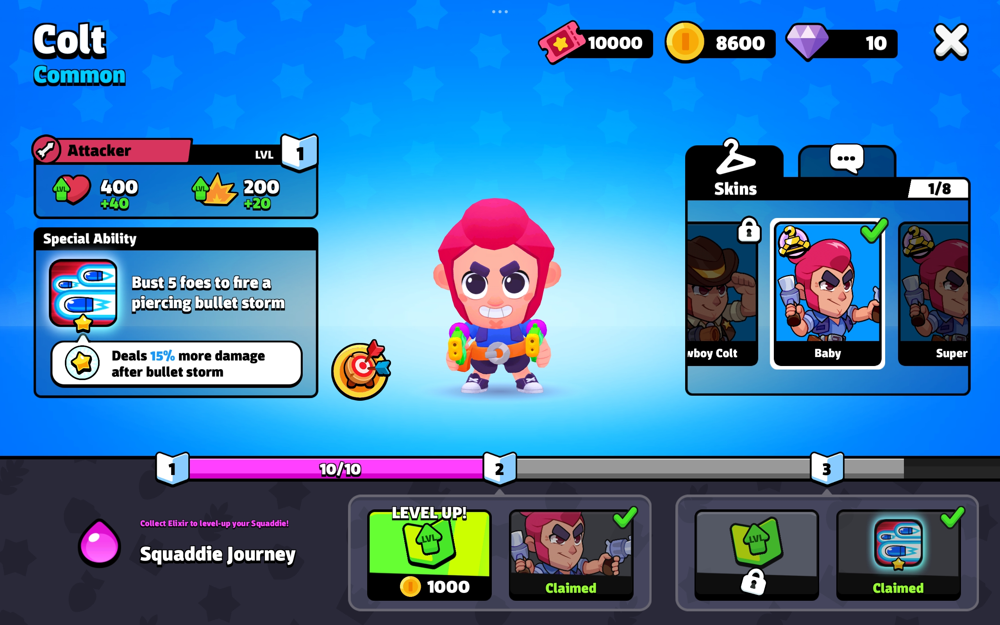
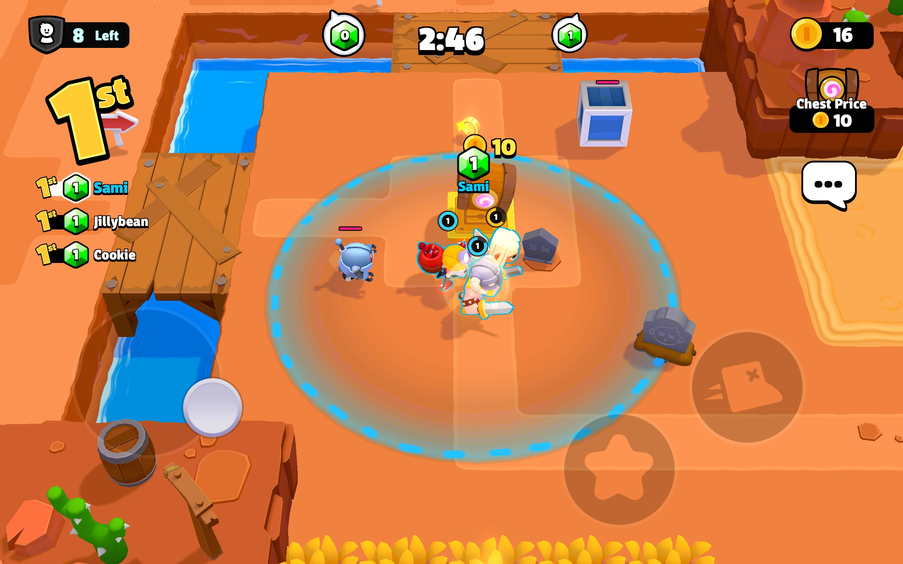
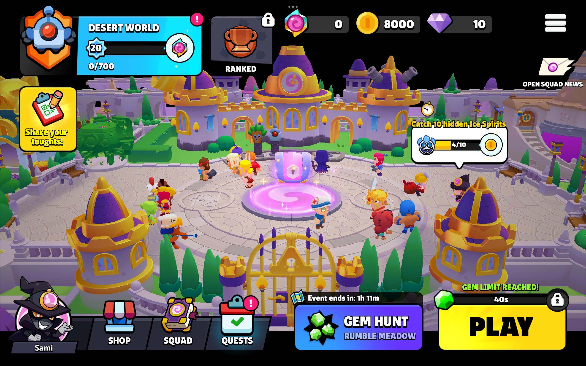

# OpenSquad-Reborn-APK
Repository for the official OpenSquad: Reborn APK

# Purpose
This repo is for (once again) the official OpenSquad: Reborn APK file, how to use Pydroid 3 to start your server and where to find the files to actually start the game! You can download it and play it! 

# Requirements
1. An Android device
2. Android 12 or higher
3. Pydroid 3 (for local-hosting and to actually run the server on phone) 

# How to use
**1.** Download the APK from this link(link)

**2.** Use [8Hacc's code](https://github.com/8-bitHacc/OpenSquad) in Pydroid (more instructions on how to use it in a bit)

**3.** Enjoy the game!

# How to use Pydroid and run the server successfully
**1.** Download Pydroid 3 from the [Google Play store](https://play.google.com/store/apps/details?id=ru.iiec.pydroid3)

**2.** Download the **ZIP** containing the code from 8Hacc's code by tapping on the green **Code** button and choosing **Download ZIP**

**3.** Extract the **ZIP** in any **file manager** (e.g. Files by Google, Amaze etc.)

**4.** After extracting the ZIP go to **Pydroid**, allow permissions to access files on your devices, find the folder containing the code (might have the name OpenSquad-master or OpenSquad-main) and do the following things:

**-** Select the file cryptoInstaller.py and run it (from the small yellow button in the down right of your screen)

**-** Close the file after it completes its task, exit it, select Main.py and run it. Important note: **DO NOT CLOSE THE APP WHILE THE CODE IS RUNNING**. Instead, make the app run in the background through your app settings! 

**5.** Enjoy OpenSquad: Reborn! 

# What does this APK Include
The current APK has:

**1.** All Squaddie skins up to Ultimate (they are white though)

**2.** Improved Textures for some skins and Squaddies (will add more in future updates)

**3.** New EXP Road with tons of rewards

**4.** Enabled Diamond packs (and some more)

**5.** New loading screen and some UI colour changes

**6.** In-game Map changes (changed to desert world instead of Green World)

**7.** New Plaza angle (can be changed via CSV files if you don't like it)

**8.** All Squaddies' power levels are increased to 10 and the pattern is changed

**9.** Special survey!

# Other bugs I might fix/stuff I might add in the future
**1.** Strange behaviour when entering a match/training grounds where the transition is laggy

**2.** Ultimate skins being white

**3.** Unique News Page

**4.** Some small errors for some animations

**5.** Loading Screen looking low res and some UI disappearing

# Special thanks
Even though I made the new client I have to thank 8Hacc for creating OpenSquad because without him this wouldn't be possible!

# Closure
I will update the client from time to time, adding new stuff (like Squaddies, skins etc.)
Have fun with the client!

 
